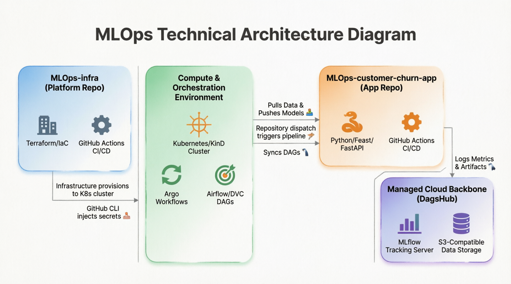

# 🚀 Architecting a Production-Grade MLOps Pipeline: The Dual-Repo Strategy

One of the most common pitfalls in MLOps is mixing infrastructure provisioning with machine learning application code. When Data Scientists and Platform Engineers share the same repository, CI/CD pipelines become bloated, permissions become a security risk, and testing becomes a nightmare.

To solve this, I designed a **Dual-Repo Architecture** that strictly separates concerns:
1. **`MLOps-infra`**: The Platform (Terraform, Kubernetes, Argo Workflows).
2. **`MLOps-customer-churn-app`**: The ML Factory (Python, Feast, Airflow/DVC, FastAPI).

In this post, we will break down the architecture, explain how the two repositories communicate securely, and explore the evolution from self-hosted storage to managed cloud backends.

---

## 🗺️ The High-Level Architecture

Below is the data and control flow between the infrastructure, the application, and the cloud backbone.

## Architecture & Component Breakdown

### Component Breakdown

#### 1. `MLOps-infra` (The Platform Foundation)
This repository is owned by Platform/MLOps Engineers. It contains zero Python ML code; it only defines the environment where the ML code will live.
* **Terraform (IaC):** Defines the Kubernetes namespaces and provisions orchestration tools.
* **Argo Workflows & CRD Management:** We use the community-maintained Argo Helm charts. A critical architectural decision here is managing Custom Resource Definitions (CRDs). Because Helm cannot upgrade CRDs in the `<chart>/crds` folder by design, our Terraform code explicitly handles CRD installation (or uses `--set crds.install=false`) to prevent upgrade failures.
* **Ephemeral KinD Cluster:** For integration testing, Terraform spins up a temporary Kubernetes-in-Docker (KinD) cluster. This allows us to test Helm charts and K8s manifests in CI without paying for a managed cloud cluster.
* **Cross-Repo Secret Injection:** The GitHub Action in this repo uses the GitHub CLI (`gh secret set`) to securely inject cloud API tokens and endpoints directly into the App repository's secrets.

#### 2. `MLOps-customer-churn-app` (The ML Factory)
This repository is owned by Data Scientists and ML Engineers. It contains the actual business logic, structured as a production-grade pipeline:
* **Feature Store (`feature_repo/`):** Powered by Feast. It manages feature transformations, using S3/Parquet for the offline store (training) and Redis for the online store (real-time serving).
* **Orchestration (`dags/` or `dvc.yaml`):**
  * *v2 (DVC):* Uses `dvc.yaml` to define the DAG, ensuring reproducible runs and intelligent caching.
  * *v3 (Airflow):* Evolves to use Airflow DAGs (`churn_training_dag.py`, `churn_drift_monitoring_dag.py`) for enterprise-grade scheduling and backfilling.
* **Core Logic (`src/`):**
  * `ingest.py` & `fetch_data.py`: Handles point-in-time correct joins from Feast.
  * `train.py` & `evaluate.py`: Model training and MLflow logging.
  * `monitor_drift.py`: Uses Evidently AI to generate HTML drift reports.
  * `gate.py`: The automated validation gate. It reads `configs/validation.yaml` (e.g., ROC-AUC > 0.8) and `configs/drift_thresholds.yaml` (e.g., data_drift_share < 0.2). If the model fails the gate, the CI/CD pipeline halts.
* **Model Serving (`serving/`):** Once a model passes the validation gate, the `deploy-serving.yml` workflow packages the FastAPI app (`app.py`, `mlflow_loader.py`) into a Docker container and deploys it.

#### 3. DagsHub (The Managed Cloud Backbone)
*The Architectural Evolution:* Initially, the infrastructure provisioned **MinIO** for S3-compatible storage. However, the official MinIO community Helm chart (`charts.min.io`) is **no longer maintained**, and source-only distribution makes CI/CD integration fragile. Furthermore, we hit the **"Ephemeral Runner Problem"**—GitHub Actions runners are temporary, meaning App runners couldn't reach the `localhost` MinIO server provisioned by the Infra runner.

**The Solution:** We migrated to **DagsHub**. 
DagsHub provides a permanently available, S3-compatible storage backend and a hosted MLflow Tracking Server. 
* **No Networking Headaches:** CI runners from any repository can push/pull data via public HTTPS endpoints.
* **Unified UI:** Data, Models, and MLflow experiments are all viewable in a single dashboard.
* **DVC Integration:** DVC seamlessly connects to DagsHub's S3 endpoint using standard AWS credentials.

#### 4. GitHub Actions (The Orchestrator)
GitHub Actions acts as the bridge and the trigger mechanism.
* **`repository_dispatch`:** When `MLOps-infra` finishes updating the platform, it sends a webhook to `MLOps-customer-churn-app` to trigger a pipeline run.
* **DAG Syncing:** In the Airflow architecture (v3), the `deploy-airflow-dags.yml` workflow automatically syncs the Python DAG files to the Airflow server whenever the `dags/` directory changes.

---

### 🔄 The End-to-End Workflow

How does a change actually flow through this system?

1. **Platform Update:** An engineer pushes a new Argo Workflow config to `MLOps-infra`.
2. **Terraform Apply:** GitHub Actions provisions the changes, carefully managing Argo CRDs.
3. **Secret Sync:** The Infra workflow securely passes the latest DagsHub tokens to the App repo.
4. **App Trigger:** The App repo receives a `repository_dispatch` event and wakes up.
5. **Data & Train:** Airflow (or DVC) pulls the latest customer data from DagsHub S3, fetches features via Feast, trains the Churn model, and logs the ROC-AUC to DagsHub MLflow.
6. **The Gate:** Evidently AI checks for data drift. If drift is < 20% and accuracy passes `validation.yaml`, the gate opens.
7. **Deploy:** The FastAPI serving container is built and pushed to the registry.

